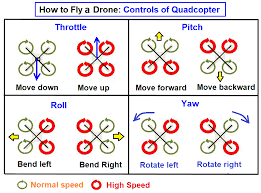
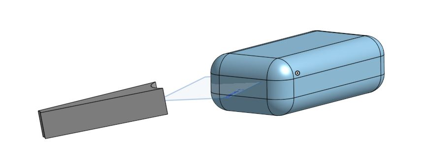
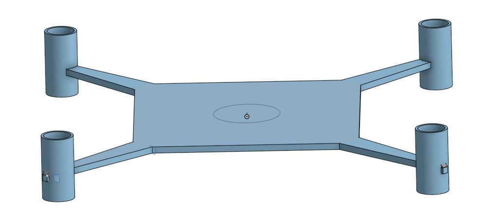
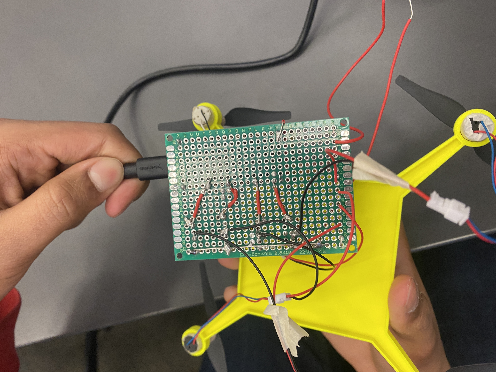
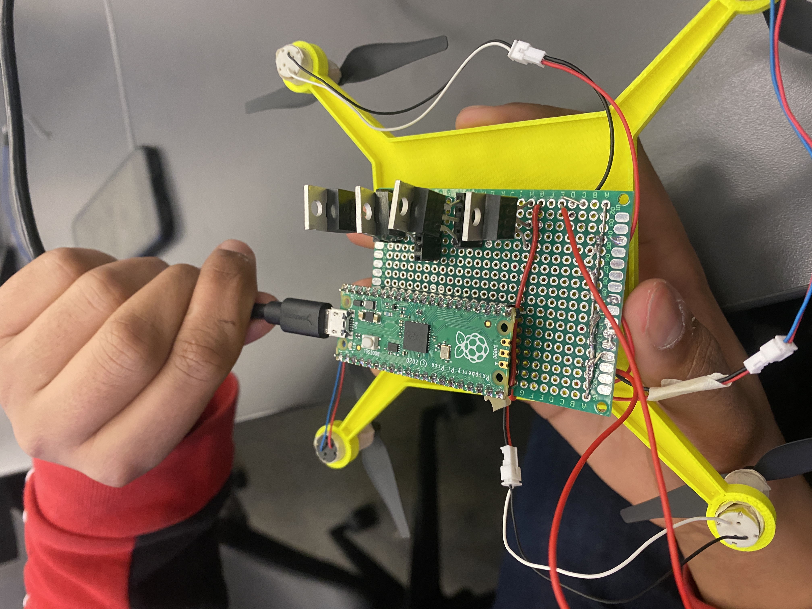

# Pi_In_The_Sky

## The Project

Times are changing. Engineers such as Quinn & Shrey are super chill, but need to stay current in order to keep being chill. Drones are the next big thing in engineering, and building one successfully: that's super chill. As engineer's in the modern times, our job is to help the world, and be chill while doing it, because we want to set a good example for others who think Engineering is for not-chill people.

What to we do? **Fly a drone controlled by a remote and be able to collect data on an altimeter, and then be able to land the drone.** The very concept of the drone screams modern while including glimpses of chillness. Collecting data while in the air adds anotfher aspect of chillness to the build. Although the drone in it's current proposal only collects flight data, it lays the foundation for additional sensors and functionalities never dreamed of before in a High School Engineering class. This drone, through it's simplicity, lays a foundation of chillness in Engineering for generations to come.

## Planning

<details>
<summary>Check out our Project Planning!</summary>

### Success Criteria

Criteria to determine if our project is a success:

1) Drone is able to take off and fly
2) Drone is able to be controlled by a remote
3) Drone can safely land
4) Data can be safely extracted and read

### Available Materials

Most of the materials we would need for our project we have in our lab. Any additional materials we need can be bought from Amazon. Currently, the only planned purchase is the drone motors. 

### Materials List

1) ABS 3D print material for frame
2) Ninjaflex 3D print material for propellor guards
2) Rasberry Pi Pico
3) Altimeter
3) 500 mAh LiPo Battery
4) 4 motors
5) Custom Circuit board
6) Other small props (undecided)

### Code

The most difficult challenge to overcome in code is to be able to program the joysticks on a controller to accurately control the drone, and get a stable PID working.

#### Motor Control

The diagram below shows how the motors will need to operate in order to move the drone is specific ways



#### Code Technicalities

I found this code snippet from online that moves a drone with joysticks using arduino:

``` c++

 LR = analogRead(A0);     // read analog joystick voltage from pin A0, returns an integer from 0-1023
 UD = analogRead(A1);     // read analog joystick voltage from pin A1, returns an integer from 0-1023
 LR = 5*LR/1023;          // convert to a voltage from 0-5V
 UD = 5*UD/1023;          // convert to a voltage from 0-5V


// convert analog voltages to motor speeds
 motor1speed = defaultSpeed+speedChange*(a*UD-a*LR);
 motor2speed = defaultSpeed+speedChange*(a*UD+a*LR-b);
 motor3speed = defaultSpeed+speedChange*(-a*UD+a*LR);
 motor4speed = defaultSpeed+speedChange*(-a*UD-a*LR+b);
  
```

Here's some links on PID to learn:

[PID Link 1](https://blog.devgenius.io/flying-a-drone-with-python-pid-control-7001a41f54ac)

[PID Link 2](https://www.technik-consulting.eu/en/optimizing/drone_PID-optimizing.html)

[PID Link 3](https://www.mathworks.com/videos/understanding-pid-control-part-1-what-is-pid-control--1527089264373.html)

### Build

#### Design

We are trying to constrain the size and mass of our design as much as possible to ensure maximum flight smoothness. We are referencing the [DJI Tello](https://m.dji.com/product/tello) for our rough dimensions. 

We have prototyped 2 rough drone designs in OnShape

First design Idea: 



Second Design Idea:



#### Special Choices

1) We are using Tello Drone specific motors for easy specification accesebility. 
2) During testing, we will make the frame out of acrylic to be conscious of material used in 3D printing (we will need to make many iterations and don't want to waste material)
3) In our final design, we will utilize ABS material for our frame, but use Ninjaflex for our propellor guards and landing buffer. This allows us the have slightly more flexibility and durability. If the drone crashes, the ninjaflex could prevent it from cracking completely.
4) Our propellor gaurds will be made detachable to the main frame (snap fit). If the drone crashes, the chances are more likely it will land on the propellor guards than any other part of the drone, so making the guards detachable allow us to only need to reprint a piece rather than the entire frame.

### Risk Mitigation

| Risk  | Possibility | Mitigation |
| ------------- | ------------- | ------------ |
| Drone Loses Control  | HIGH | Add a Killswitch |
| Overheating | HIGH | Wear gloves in post flight recovery |
| Frame cracks | HIGH | Build detachable propellor guards |
| Drone activation unknown | Medium | Add ON light(green) |
| Drone Explodes  | Low  | Have fire extinguisher on Standby |


| Testing Risks | Possibility | Mitigation |
| ------------- | ------------- | ------------ |
| Doesn't respond w/ controller | HIGH | Build controlled testing piece (string) |
| Frame reconstruction | Medium | Laser cut body & 3D print motor part |


### Proposed Schedule & Milestones

| Week  | Tasks | Milestone |
| ------------- | ------------- | ------------ |
| 12/12 - 12/15 | General - Work On Project Proposal | Finish Proposal |
| 12/18 - 1/2 | Winter Break | Chill |
| 1/3 - 1/6 | Build Drone in CAD / PID Stablization Code | No Milestone / Have stabilizing motors |
| 1/9 - 1/13 | Continue CAD Drone / Troubleshoot PID & Work on Joystick Control | Print 1st prototype drone / Finalize PID Stability |
| 1/16 - 1/20 | Assemble and Test 1st prototype[^1] | Complete Prototype |
| **1/20** | **Quarter Ends** | **Try to have a Prototype in Testing** |
| 1/23 - 1/27  | Reiterate design / Debug & Improve code  | No Milestone |
| 1/30 - 2/3 | Assemble and Test 2nd Prototype[^2] / Test Joystick Code | No Milestone |
| 2/6 - 2/10 | Continue iterating Design & Code | Complete 2nd Prototype if not already done |
| 2/13 - 2/28 | Work towards building Final Prototype[^3] | Finish Final Prototype (2/28) |
| 3/6 - 3/31 | Design Refinement & Final Tweaks | Ready to launch |
| **3/30** | **Quarter Ends**| **Ready to Launch** |
| 4/3 - 4/7 | First Project Launch | Launch Drone and Collect Data |
| 4/10 - 4/14 | Modify Build/Code & Prepare to relaunch next week | Analyze 1st launch data & have drone ready for relaunch |
| 4/17 - 4/21 | Second Project Launch | Launch Drone & Collect/Analyze Data |
| 4/24 - 4/28 | Buffer Week | Catch up on schedule |
| 5/1 - 5/5 | Final Project Documentation | Add Analyzed Data & Finish Final Project Documentation |
| 5/8 - 5/19 | Buffer Weeks | Catch up on Schedule |
| **5/19** | **Project Due** | **Submit GitHub Repo on Canvas** |
| 5/22 - 6/9 | EMERGENCY PROJECT WORK (if required) | FINISH PROJECT / Chill & Enjoy Flying Drone |
| **6/9** | **LAST DAY OF SCHOOL** | **PLACE DRONE ON WALL OF FAME** |


[^1]: First Prototype is to be a controlled flight (attached to string and not actually free flying)
[^2]: Second Prototype is to be a slightly free flighted prototype (will not be flying above 5 feet)
[^3]: Final Prototype is a fully functional drone prototype very similiar to the final product

 </details>
 
## Weekly Milestones
 
### 1/3 - 1/31
 
#### General
 
Obviously a week does not consist of 28 days. But this is a one-off thing. We forgot to document this month, but we will start now. These few weeks haven't been the MOST productive (not because we haven't been trying, we just haven't had materials). We've made progress on the Code and CAD though.
 
#### Code
 
So far we have a working (with one joystick) code, that (in theory) steers the drone. We have tested in only on the serial monitor by printing out the speed values of the motor according to the joystick position. We also have a slighlty incomplete and untested PID code for the drone. It can't be finished till we get the motors so we know what values to use, and then we would need to test to see if it even REMOTELY works...who knows...Here's some of that code below, but we'll add new versions across weeks so you can see our progress!

<details>
<summary>Code Week 7</summary>

Joystick Control:

```python

import time
import board
from analogio import AnalogIn
import simpleio

joy_x = AnalogIn(board.GP27)
joy_y = AnalogIn(board.GP26)

#motor1pin = ()
#motor2pin = ()
#motor3pin = ()
#motor4pin = ()
hoverSpeed = 130;   # default PWM value
speedChange = 90;     # PWM value to add or subtract
ramp_delay = 40;      # loop delay time for motor ramp up in milliseconds
a = 0.3;            # constant for converting analog voltages to PWM values
b = 1.5;            # offset for converting voltages to PWM values

while True: 
    
    LR = simpleio.map_range(joy_x.value, 0, 65520, 0, 5)
    UD = simpleio.map_range(joy_y.value, 200, 65520, 0, 5)
    
    # make analog (or whatever) values into voltage values or map the values to how the ramge motors operate

    motor1speed = hoverSpeed + speedChange*(a*UD-a*LR)
    motor2speed = hoverSpeed + speedChange*(a*UD+a*LR-b)
    motor3speed = hoverSpeed + speedChange*(-a*UD+a*LR)
    motor4speed = hoverSpeed + speedChange*(-a*UD-a*LR+b)

    # make code to send speeds to motors

    print(f"Motor 1 = {motor1speed}")
    time.sleep(0.2)
    print(f"Motor 2 = {motor2speed}")
    time.sleep(0.2)
    print(f"Motor 3 = {motor3speed}")
    time.sleep(0.2)
    print(f"Motor 4 = {motor4speed}")
    time.sleep(0.2)
```

PID: 
 
```python

 # Code to stablize drone

import time
import board
import adafruit_mpu6050
import busio

sda_pin = board.GP14
scl_pin = board.GP15
i2c = busio.I2C(scl_pin, sda_pin)

mpu = adafruit_mpu6050.MPU6050(i2c)

int motor1pin = ()
int motor2pin = ()
int motor3pin = ()
int motor4pin = ()
int defaultSpeed = 
int motor1speed = defaultSpeed
int motor2speet = defaultSpeed
int motor3speed = defaultSpeed
int motor4speed = defaultSpeed
speedChange = 0
const float Kp = () # proportional gain
const float Ki = () # integral gain
const float Kd = () # derivative gain
float ingerror
float lastError

gain = () #how much the sensor changes (dy) with respect to dx (1 notch up) 


daccx = (the flat x value)
daacy = ()
daacz = ()

error = 0

startTime = time.monotonic
loopTime = 0

while True:
    elapsedTime = startTime - loopTime

    # Get acceleration in g's
    x = mpu.acceleration[0] / 9.8
    y = mpu.acceleration[1] / 9.8
    z = mpu.acceleration[2] / 9.8

    roll = 57.2958*atan2(y,z);
    pitch = 57.2958*atan2(-x,sqrt(y*y+z*z));

# PID controller to find speedChange

    joystick1 = () #read analog joystick value
    targetPitch = map(joystick1, 0, 1023, -45, 45 )
    elapsedTime =     #insert function to get time since last loop
    error = (targetPitch - currentPitch)
    ingerror = ingerror + error * elapsedTime
    dxerror = (error - lastError)/elapsedTime
    speedChange = Kp*error + Ki*ingerror + Kd*dxerror
    error = lastError

# Changes motor speeds using calculates speedChange variable
    motor1speed = defaultSpeed + speedChange
    motor2speet = motor1speed
    motor3speed = defaultSpeed + speedChange
    motor4speed = motor3speed
    
    loopTime = time.monotonic
 
 ```
</details>

 #### CAD

12/15 - 1/5: The is the first design for our drone. The first design was supossed to be a box to hold all of the components. We shelled the inside of this design. In the end, we started over from scratch because for our first prototype and this early in the build, we didn't know all of the components needed, so a box wasn't working.


2/1/23: We have completed the CAD design in Onshape and have begun to get the parts printed. The design is comprised of 3 different parts: the main structure, motor mounts, and rotor guards. There will be only 1 copy of the main structure. and this will hold all of the elctronics in the middle and be the arms that extends out to the rotors. There will be 4 copies of the motor mounts printed. These mount the motors onto the main structure and attach the rotor guards as well. There will also be 4 of the rotor guards printed, and these will extend out to protect the rotos, so that if the drone bumps into an object it contacts the rotor guards rather than causing damage by hitting the rotors themselves. At this time we have the motor mounts and main structure printed and attach, and we are waiting on the rotor guards. We are also waiting on the motors to be delivered so that we can assemble and start testing the prototype. The different parts and current physical assembly are pictured below:

Main Structure:  


Motor Mount:  


Rotor Guard:  


Current Physical Assembly:  


### 2/1 - 2/10

#### General

We made a lot of progress in these 2 weeks. The focus was more about getting the physical drone functional, because without it we couldn't really test any of the code. 

#### Wiring

The code section for this week has been replaced by wiring. Our main goal was figuring out how to get our motors and pico wired up on a breadboard so that all the motors worked. Let me tell you, it was a PAIN. Look at the wiring diagram below. It shows all the wires needed for ONE motor. Then imagine how many we would need for 4 motors.


Anyway, we got it all hooked up, and now we're trying to find ways to optimize our wiring so we can fit it all on one PCB. I also wrote up a quick ~5 line code to just send power to the motors so we can test and see which ones work and don't. 

#### Build

### 2/13 - 2/24

#### General

There were A LOT of changes since the last update. Things are looking a lot better and more promising.

#### Wiring

Yep. Still no code. We are continuing to work on the physical building on the drone till we get it to our "first prototype stage". We are slightttttly behind schedule (we were supposed to be working on final/3rd prototype now), but we're not to behind. Our schedule was very rigorous and overshot anyways. The big changes have come on the wiring front - we figured out a way to wire up all our motors without any diode or resistors. We switched to using MOSFETS as our transistors, and it DRASTICALLY reduces how many wires we need. Here's a picture of our PCB that we "completed" today. 




Now, our wiring isn't perfect, because the motors don't work with this setup, which is weird. We soldered on the first motor (with the MOSFET that is directly soldered onto the board....) and it worked perfect. Then, all we did was Ctrl+C & Ctrl+V for the next 3 motors, and in theory, they should've all worked. Somehow, only 2 motors run AND they just get directly powered from the battery without getting regulated by the pico. What's even MORE confusing is that the first motor we soldered on stopped working. Something is wrong, and we'll work on that next week. Worst comes worst, we'll have to take off the 3 added motors and test it as we solder along (which we probably should've done in the first place).

#### Build


### 2/27 - 3/10

#### General

We've started to shift into our "iternation" stage of our project. We have a "completed" drone, but not really. Our PCB is wired up to our motors, and the drone does fly, but obviously nothing else works. If we let it free fly right now, it will go up, take a sharp turn, and slam into someones face and cause a few cuts. So the correct decision was to do some "controlled" testing.

#### Code

The code section is back! We haven't needed to actually use code for the past few weeks, but we're back on it. We need to get our PID code working so we can start to do some "free(er)" flights. This is the hard part unfortunately. We messed around a but with it, but ran into more problems. The code was not correcting at all, and so we had to do some debugging. To start, we printed out some of the variables in our code such as "speedChange" or "target/currentPitch". Through this process, it was found that there were a few variables that were declared incorreclty causing the whole code to output "0". It was also because I set "error = lasterror", instead of "lasterror = error". All that for a week... We had other problems through our testing too, which were not even related to code:(

#### Build

One of the main build aspects of our project over these 2 weeks wasn't realted to the actual drone, but the PID tester stand. I built a small stand so that we could test our PID in a controlled way on one axis. Unfortuntely, it was a slightly scrappy creation, and when that results in: scrapiness(stand+drone+wiring) + tape = hell. We had so much tape on this version of the stand (as you can see by the picture below), and it was a mess. 


### 3/13-3/24

#### General

These 2 weeks we worked on tuning the PID code more and designing a new drone base and other parts. We attached the drone to our metal pivot base and were using it to get different values to use in the PID. We had a few small soddering deconnection issues that required we take the drone off of the base to fix them, but they are now connected securly. For the second week we discussed and designed a new baseplate for the drone that would allow it to hold and easily swap out batteries, and securely attach the board away from any interference with the propellers. We initially had a hole in the middle of the baseplate, underneath the board, that would allow the wires to travel through and then underneath to the motor. However, we realized that this wasn’t feasible as it would interfere with a battery mount, and it would make it much more difficult to attach and detach the board to get to the wiring underneath, as the motor wires would have to all be detached and run through the hole. We decided that we’d keep the wires from interfering with the propellers by wrapping them around the arms on the way to the propeller, which was a much more effective solution. We designed a simple press-fit battery mount on the bottom of the drone, that would allow batteries to easily be swapped.

<details>
<summary>Current PID Code</summary>

Joystick Control:

```python


```
</details>

Drone baseplate top view:   


Baseplate battery holder view:  


### 3/27-3/30

#### General

This week we worked on assembling the parts that had been printed over the weekend, which included the new drone baseplate, motor, holders, and rotor guards. We then constructed a base for test flight, which involved securing the drone to a piece of wood with string. This gives it more freedom and ability to utilize the PID balancing code than the previous metal mount. We then performed some test flights with this system, working on tuning the PID values. The new drone construction (with the new 3d printed parts) had plenty of lift to lift off of the ground. We also modified the wiring to the battery to have one header on the top of the board that would then have a wire going to the battery, rather than that wire being directly soldered to the board. When unplugged, this wire would cut all battery power to the drone, which allows us to easily shut down the drone if it is getting out of control without getting nicked by the propellers. This is also important for allowing us to power on the drone safely, without getting hit by the propellers when they start up.

Newly Printed Propellor Guards:  


New drone on test flight base:  
  


Header with shut-off wire:  


